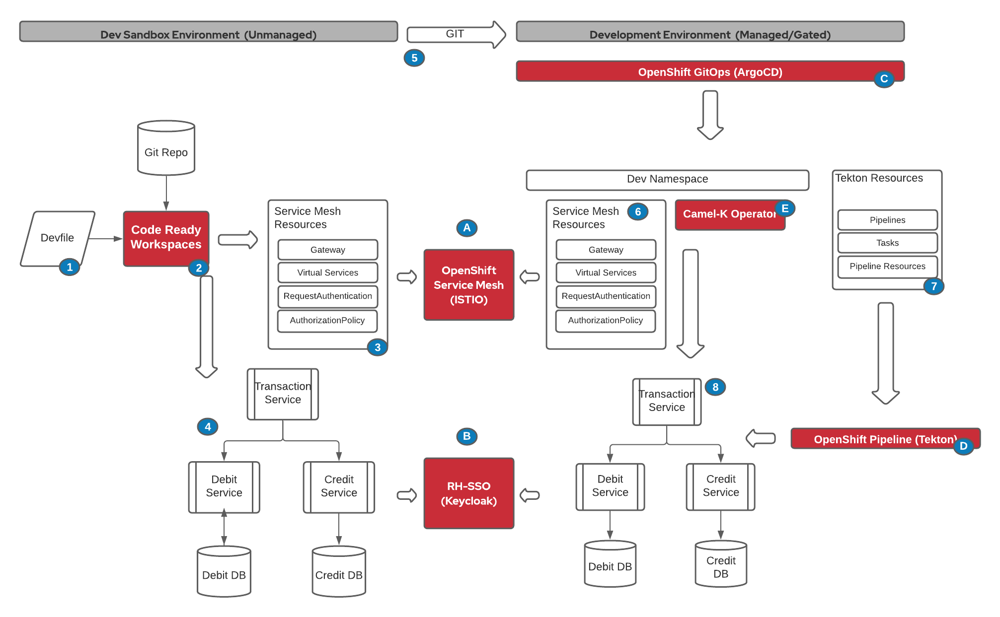

For installation instruction, please click here.

This is a demo of a development workflow using Camel-K for a simple integration application.

The application is composed of 3 microservices:
* Transaction Service
* Credit Service
* Debit Service

The Transaction services uses several Enterprise Integration Patterns (EIP) to interact with the two backend services (Credit and Debit) such as content-based router (CBR), parallel processor and aggregator.

From a high level, the application logical architecture looks like:

The network flow and security at the ingress point and between microservices is controlled by OpenShift Service Mesh (Istio).

This demo, sets up the following tools and process:

* **Step A** Apicurio, a collaborative OpenAPI design and validation interface, is used to build the OpenAPI specifications that will be used by Camel-K to automatically generate the API 

* **Step 1** A devfile to automatically creates the developer tooling for Camel-K including test/debug utilities and all required CLI to interact with OpenShift

* **Step B** CodeReady Workspaces(CRW) interprets the devfile and provision the secure and persistent environment for the developer

* **Step 2** The developer uses CRW to create and deploy the OpenShift Service Mesh resources required by the application

* **Step C** OpenShift Service Mesh (OSSM) based on Istio, automatically detects the desired configuration and applies it to the developer's sandbox.

* **Step 3** The developer uses CRW to create the Camel-K services and deploy them to his/her sandbox environment.

* **Step D** OSSM automatically detects that OIDC claims and authentication are required and RH-SSO generates or validates the auth token with different claims.

This concludes the demo for the developer sandbox. The developer sandbox is considered unmanaged, as it requires no gating, approval. The developer can change and deploy configuration and application to align to business needs.

The next step are installing and configuring a managed, secure and controlled environment to deploy the same application using automation provided by OpenShift Container Platform.

* **Step 4** When a change is commited and the pull request is merged to the main branch in Git, it triggers a sequence of autonation to deploy the application in an integrated development environment,

* **Step E** OpenShift GitOps, based on ArgoCD, is notified automatically of the change and apply the required configuration and application changes to the OpenShift cluster

* **Step 5** The Istio Configuration is applied and the namespace is added to the Istio managed namespace

* **Step C** OpenShift Service Mesh (OSSM) based on Istio, automatically detects the desired configuration and applies it to the developer's sandbox.

* **Step 6** The required CI steps, tasks and pipelines are synced from GIT to the OpenShift Pipelines by OpenShift GitOps.

* **Step F** OpenShift Pipelines, based on Tekton, executes the pipelines to build and deployed the microservices to the managed namespace

* **Step G** Camel-K operator detects the new integration routes and assemble the application

* **Step 7** The application with all the microservices are running in the managed environment.

* **Step C** OSSM automatically detects that OIDC claims and authentication are required and RH-SSO generates or validates the auth token with different claims.