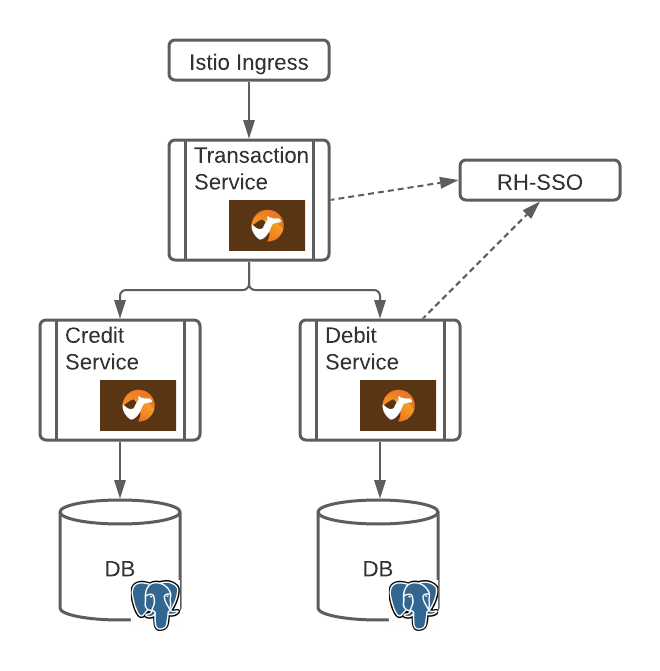
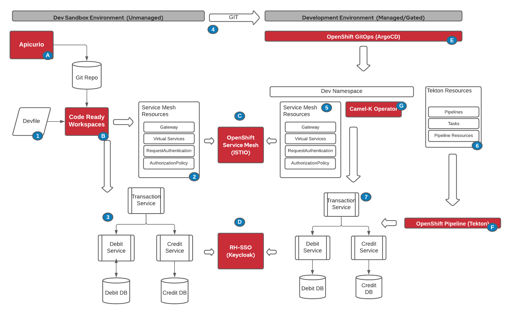

For installation instruction, please click here.

This is a demo of a development workflow using Camel-K for a simple integration application.

The application is composed of 3 microservices:
* Transaction Service
* Credit Service
* Debit Service

The Transaction services uses several Enterprise Integration Patterns (EIP) to interact with the two backend services (Credit and Debit) such as content-based router (CBR), parallel processor and aggregator.

From a high level, the application logical architecture looks like:


The network flow and security at the ingress point and between microservices is controlled by OpenShift Service Mesh (Istio).

This demo, sets up the following process:



# camel-demo
Pré-requis
l'Operator Camel-K doit être déployé dans le namespace ou cluster utilisé.

L'outil CLI Kamel doit être installé.

Étape 1
Création des bases de données:

```
oc apply -k manifests/database/creditdb
oc apply -k manifests/database/debitdb
```

Création des secrets pour les services:
```
oc apply -f apps/creditservice/db-secret.yaml
oc apply -f apps/transactionservice/db-secret.yaml
```


Étape 2
Déployer les services:

```
kamel run --profile=openshift --open-api=apps/creditservice/creditservice-openapi.yaml --config secret:my-datasource --build-property quarkus.datasource.camel.db-kind=postgresql  -d mvn:io.quarkus:quarkus-jdbc-postgresql -t knative.enabled=false apps/creditservice/creditservice.java
```

```
kamel run --profile=openshift --open-api=apps/debitservice/debitservice-openapi.yaml --config secret:my-debit-datasource --build-property quarkus.datasource.camel.db-kind=postgresql  -d mvn:io.quarkus:quarkus-jdbc-postgresql -t knative.enabled=false apps/debitservice/debitservice.java
```

```
kamel run --profile=openshift --open-api=apps/transactionservice/transactionservice-openapi.yaml -t knative.enabled=false -t route.enabled=true apps/transactionservice/transactionservice.java

```